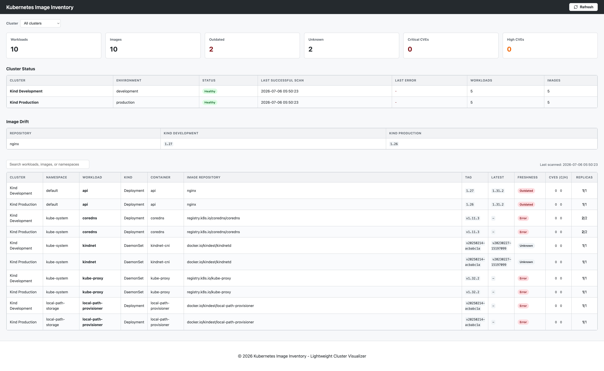
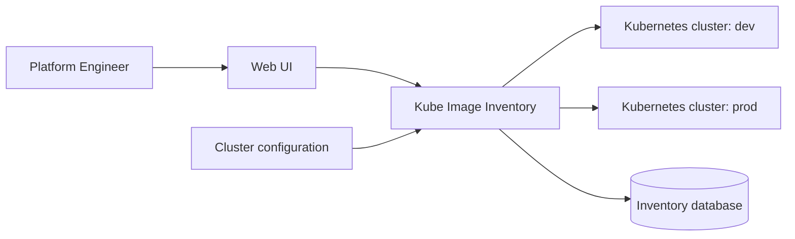

# Kubernetes Image Inventory

Kubernetes Image Inventory collects workload and container-image information from one or
more Kubernetes clusters and presents it through a small web dashboard. It supports local
kubeconfig contexts and in-cluster execution, with optional Trivy Operator vulnerability
data and registry freshness checks.



## Features

- Inventories Deployments, StatefulSets, DaemonSets, and CronJobs and the images they run.
- Scans multiple clusters through explicitly configured kubeconfig contexts, or a single
  in-cluster deployment.
- Per-cluster scan status (`healthy`, `stale`, `unreachable`, `unknown`) and dashboard
  filtering by cluster.
- Image drift detection: flags the same image repository running with different tags
  across clusters.
- Optional Trivy Operator integration for per-container CVE counts.
- Registry freshness checks against Docker Hub and GHCR.

## How it works



Enabled clusters are loaded from configuration at startup and on each refresh. For every
configured cluster the app builds an isolated Kubernetes client tied to that cluster's
kubeconfig context, then collects workloads and images independently, cluster by cluster.
Results are stored with their cluster identity and shown together in one dashboard. If a
cluster's scan fails, its last successful inventory stays visible and only that cluster is
marked stale - other clusters keep refreshing normally.

## Quick start

### Local single-cluster mode

```bash
git clone https://github.com/mstrugarevic1/kube-image-inventory.git
cd kube-image-inventory

python -m venv .venv
source .venv/bin/activate
pip install -e ".[dev]"

cp .env.example .env
make run
```

`make run` starts the app against your local kubeconfig's current-context at
`http://127.0.0.1:8000`.

### Multi-context demo

```bash
make demo-up    # create two Kind clusters and deploy sample workloads
make demo-run   # reset the local database and run the app against both clusters
make demo-down  # delete both Kind clusters
```

The demo deploys the same workload to both clusters with different `nginx` tags, so the
dashboard's image drift view has something to show.

## Configuration

| Variable | Purpose | Default |
| --- | --- | --- |
| `KUBE_ACCESS_MODE` | `auto`, `incluster`, or `multicontext` | `auto` |
| `KUBECONFIG_PATH` | Kubeconfig file path (empty = client library default) | *(empty)* |
| `CLUSTERS_CONFIG_PATH` | Multi-context cluster list | `./config/clusters.yaml` |
| `DATABASE_URL` | SQLAlchemy database URL | `sqlite:///./inventory.db` |
| `SCAN_INTERVAL_SECONDS` | Background scan interval | `900` |
| `CLUSTER_STALE_AFTER_SECONDS` | Age before a healthy cluster is shown as stale | `1800` |
| `KUBE_IMAGE_INVENTORY_DEV_KUBECONFIG` | Enables local-kubeconfig fallback under `auto` mode | `false` |

In `multicontext` mode, clusters are read from a YAML file such as
`config/clusters.example.yaml`:

```yaml
clusters:
  - id: kind-dev
    name: Kind Development
    context: kind-kii-dev
    environment: development
    enabled: true
```

Only the contexts listed there are ever scanned - the app does not enumerate or scan every
context in your kubeconfig.

## Kubernetes deployment

In-cluster mode (`KUBE_ACCESS_MODE=incluster`) uses the pod's ServiceAccount and scans only
the cluster the app is running in. The included RBAC (`deploy/kubernetes/base/rbac.yaml`) is
read-only (`get`/`list`/`watch`).

```bash
kubectl apply -k deploy/kubernetes/base
```

Multi-context mode instead requires mounting a trusted kubeconfig into the pod and network
access from the pod to every configured cluster's API server. Never commit a real
kubeconfig or static ServiceAccount tokens to this repository.

## Development

```bash
pytest
ruff check .
```

## Limitations

- SQLite is intended for local use or a single small deployment, not high availability.
- The central process needs network connectivity and read credentials for every
  configured cluster; multi-context mode centralizes that access in one place.
- Clusters are scanned sequentially, not in parallel.
- Registry freshness checks depend on the registry's public API and are only implemented
  for Docker Hub and GHCR.
- Vulnerability data requires a working Trivy Operator installation; without it, scans
  continue normally with no CVE data.
- There is no built-in authentication on the web dashboard.
- There is no schema migration framework; `make reset-db` is required after schema changes.
