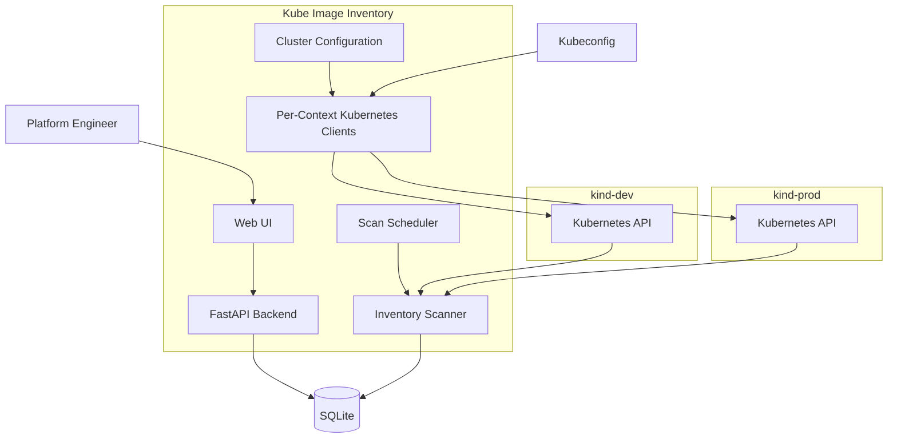

# Kubernetes Image Inventory

A lightweight, server-rendered dashboard that inventories the container images running
across one or more Kubernetes clusters: workloads, image tags, registry freshness, and
(optionally) Trivy Operator vulnerability counts.

## Screenshot


> [!NOTE]
> This is a portfolio-grade MVP demonstrating multi-cluster Kubernetes integration. It is
> **not** a production-ready control plane - see [Security limitations](#security-limitations)
> and [Future architecture](#future-distributed-collector-architecture) below.

## What it does

`kube-image-inventory` periodically scans the Kubernetes clusters you explicitly configure,
records every Deployment, StatefulSet, DaemonSet, and CronJob together with the container
images they run, and shows it all in one dashboard - filterable by cluster, with per-cluster
health status and a view of image tags drifting between environments (e.g. `nginx:1.27` in
dev vs `nginx:1.26` in prod).

Key features:

- **Multi-cluster inventory** - scan an explicit allowlist of kubeconfig contexts, or the
  cluster the app itself runs in.
- **Cluster health** - each configured cluster shows as `healthy`, `stale`, `unreachable`,
  or `unknown` based on its own scan history; one cluster being down never hides another
  cluster's data.
- **Image freshness** - flags images running an older tag than what's available in the
  registry.
- **Image drift** - highlights the same image repository running with different tags
  across clusters.
- **Vulnerability reporting** - integrates with Trivy Operator (if present) to show CVE
  counts per container, matched strictly within each cluster.

## Single-cluster vs. multi-cluster modes

The app supports three `KUBE_ACCESS_MODE` values:

| Mode | Behavior |
| --- | --- |
| `incluster` | Scans only the cluster the app is running in, using its mounted ServiceAccount. Represented as one configured cluster (`INCLUSTER_CLUSTER_*` settings). This is the original single-cluster deployment model, unchanged. |
| `multicontext` | Scans exactly the kubeconfig contexts listed in `CLUSTERS_CONFIG_PATH` - nothing more. Fails startup with a clear error if the file is missing, invalid, or has duplicate cluster IDs. |
| `auto` (default) | Prefers in-cluster credentials; otherwise uses the multi-context config file if one exists; otherwise falls back to the local kubeconfig's current-context (the original local dev workflow, gated by `KUBE_IMAGE_INVENTORY_DEV_KUBECONFIG=true`). |

## Multi-context architecture



The application itself stays a single process with one SQLite database. For each configured
cluster it builds an **independent** `kubernetes.client.Configuration` / `ApiClient` pair (see
`app/k8s_client.py`) so that building or using one cluster's client can never leak into, or
overwrite, another cluster's credentials or connection settings. Clusters are scanned
**sequentially** - this is an MVP, not a distributed collector platform.

### Why explicit context allowlisting?

The app never enumerates "every context in your kubeconfig" and scans whatever it finds. It
only ever touches the kubeconfig contexts you explicitly list in `config/clusters.yaml`. This
is a deliberate safety boundary: a kubeconfig can contain credentials for clusters far more
sensitive than the ones you intend this tool to touch (e.g. a personal kubeconfig that
also has prod-admin contexts). Explicit allowlisting means a misconfigured or overly broad
kubeconfig can't silently expand what gets scanned.

## Local installation

Prerequisites: Python 3.11+, and (for local kubeconfig mode) a valid `~/.kube/config`.

```bash
# Install dependencies
pip install -e ".[dev]"

# Run tests
pytest

# Lint
ruff check .

# Run against your local kubeconfig's current-context (original single-cluster workflow)
make run
```

## Two-Kind-cluster demo

A reproducible local demo lives under `examples/multicluster/`. It creates two
[Kind](https://kind.sigs.k8s.io/) clusters, deploys the same workload name (`api`, in
`default`) to both with **different image tags**, and points the app at both.

```bash
make demo-up    # create kii-dev / kii-prod Kind clusters, deploy sample workloads,
                # and write config/clusters.yaml
make demo-run   # reset the local db and start the app against both clusters
make demo-down  # delete both Kind clusters
```

`make demo-up` runs `examples/multicluster/create-clusters.sh`, which:

1. Creates Kind clusters `kii-dev` and `kii-prod` (kubeconfig contexts `kind-kii-dev` /
   `kind-kii-prod`), skipping any that already exist.
2. Deploys `examples/multicluster/dev-workload.yaml` (`nginx:1.27`) to `kii-dev` and
   `examples/multicluster/prod-workload.yaml` (`nginx:1.26`) to `kii-prod`.
3. Writes `config/clusters.yaml` from `examples/multicluster/clusters.yaml`.

All steps use `kubectl --context <name>` explicitly - never `kubectl config use-context` - so
your own kubeconfig's current-context is left untouched. Every step is safe to rerun.

Once running, open `http://127.0.0.1:8000`, and you should see both clusters, their
`healthy` status, and an **Image Drift** row for `nginx` (`1.27` vs `1.26`).

To see cluster isolation in action, stop one cluster's container (e.g.
`docker stop kii-dev-control-plane`) and click **Refresh**: the other cluster keeps
refreshing normally, the stopped cluster's previously-collected workloads remain visible,
and its status changes to `stale`.

## Cluster configuration format

See `config/clusters.example.yaml`:

```yaml
clusters:
  - id: kind-dev          # stable, unique identifier - used as the DB foreign key
    name: Kind Development # display name
    context: kind-kii-dev  # kubeconfig context name
    environment: development
    enabled: true
  - id: kind-prod
    name: Kind Production
    context: kind-kii-prod
    environment: production
    enabled: true
```

Copy it to `config/clusters.yaml` (gitignored) and point `CLUSTERS_CONFIG_PATH` at it, or
use a different path entirely. Validation rejects: duplicate `id`s, missing/blank `context`
values, an empty `clusters` list, invalid YAML, and a file where every cluster is disabled.

## Environment variables

See `.env.example` for the full annotated list. The important ones:

| Variable | Default | Purpose |
| --- | --- | --- |
| `KUBE_ACCESS_MODE` | `auto` | `auto`, `incluster`, or `multicontext` |
| `KUBECONFIG_PATH` | *(empty)* | Optional explicit kubeconfig path (default: client library default) |
| `CLUSTERS_CONFIG_PATH` | `./config/clusters.yaml` | Multi-context cluster list |
| `CLUSTER_STALE_AFTER_SECONDS` | `1800` | Age threshold before a healthy cluster is shown as stale |
| `INCLUSTER_CLUSTER_ID` / `_NAME` / `_ENVIRONMENT` | `local-cluster` / `Local Cluster` / `local` | Identity used for the single cluster in `incluster` mode |
| `KUBE_IMAGE_INVENTORY_DEV_KUBECONFIG` | `false` | Enables the local-kubeconfig fallback under `auto` mode |
| `SCAN_INTERVAL_SECONDS` | `900` | Background scan interval |

## Cluster status semantics

Each cluster's displayed status is derived purely from its own scan history
(`app/services/cluster_status.py`):

- **`unknown`** - no scan has been attempted yet.
- **`healthy`** - the most recent scan completed successfully, recently enough
  (within `CLUSTER_STALE_AFTER_SECONDS`).
- **`stale`** - the latest scan failed but earlier data still exists, or the last
  successful scan is older than `CLUSTER_STALE_AFTER_SECONDS`.
- **`unreachable`** - the cluster has never completed a successful scan, and the latest
  attempt failed.

A failed scan **never** deletes or hides previously collected data for that cluster, and
never touches another cluster's data.

## Image drift

The dashboard's **Image Drift** section (`app/services/image_drift.py`) groups containers by
image repository across the selected cluster(s), and shows only repositories running more
than one distinct tag - e.g. the same `nginx` image at `1.27` in dev and `1.26` in prod.
Digest-based images are shown with a shortened digest.

## Trivy behavior

If [Trivy Operator](https://github.com/aquasecurity/trivy-operator) is installed and its
`VulnerabilityReport` CRDs are reachable, reports are matched to containers strictly within
the same cluster (`Container -> Workload -> cluster_id`) - a report from one cluster can
never update a workload in another. If the CRDs are missing or inaccessible, this is logged
as informational and the rest of the inventory scan continues normally; it never fails the
cluster's scan.

## Security limitations

- This tool is read-only by RBAC design (`deploy/kubernetes/base/rbac.yaml`) - `get`,
  `list`, `watch` only, no mutation permissions.
- There is no authentication or authorization on the web UI. Do not expose it publicly
  without putting your own auth in front of it.
- In multi-context mode, the mounted kubeconfig is as powerful as the credentials it
  contains. **Only use kubeconfigs from trusted sources, scoped to read-only access.**
  Never commit a real kubeconfig to this repository.
- Kubeconfig credentials, tokens, and certificate data are never logged. Scan failures are
  logged and displayed with sanitized, truncated messages.
- There is no mTLS between this app and the clusters it scans beyond what your kubeconfig /
  ServiceAccount already provides.

## Troubleshooting

- **Startup fails with a cluster configuration error** - `KUBE_ACCESS_MODE=multicontext` (or
  `auto` when a config file is present) validates `CLUSTERS_CONFIG_PATH` at startup and fails
  fast with a specific reason: missing file, invalid YAML, duplicate cluster IDs, a blank
  `context`, or no enabled clusters.
- **A cluster shows `unreachable`** - it has never completed a successful scan and the
  latest attempt failed; check the shortened error in the Cluster Status table and your
  network/RBAC access to that context.
- **A cluster shows `stale`** - either its latest scan failed (previous data is still shown)
  or its last successful scan is older than `CLUSTER_STALE_AFTER_SECONDS`.
- **Refresh button says a refresh is already running** - only one refresh cycle runs at a
  time (`max_instances=1`); wait for it to finish or check back shortly.
- **Schema changed after pulling an update** - the SQLite database is disposable in this
  MVP (there is no migration framework). Run `make reset-db` and let the next scan
  repopulate it.

## Future distributed collector architecture

**Current MVP:** the central application pulls inventory directly from multiple kubeconfig
contexts, sequentially, from one process.

**Possible future architecture:** lightweight per-cluster collectors running inside each
cluster push periodic inventory snapshots to a central service over an authenticated
channel, removing the need for the central app to hold direct kubeconfig credentials for
every cluster. This MVP does not implement collectors, a message queue, or mTLS between
components - see [Non-Goals] in the project scope for the full list of what's deliberately
out of scope for now.

## Repository structure

- `app/` - FastAPI application, Kubernetes client factory, inventory/Trivy collection,
  cluster status and image-drift services, Jinja templates.
- `config/` - example (and, locally, your own gitignored) cluster configuration.
- `examples/multicluster/` - two-Kind-cluster demo scripts and manifests.
- `deploy/` - Kubernetes manifests for in-cluster deployment.
- `tests/` - automated test suite (mocked Kubernetes clients - no live cluster required).
- `.github/workflows/` - CI (lint + test + Docker build).

## Tech stack

- **Python 3.11+**, FastAPI, Jinja2 (server-rendered, no frontend framework)
- **SQLAlchemy** over SQLite
- **kubernetes** Python client, one isolated client per configured cluster
- **APScheduler** for the background refresh loop
- **Docker** for containerized execution
